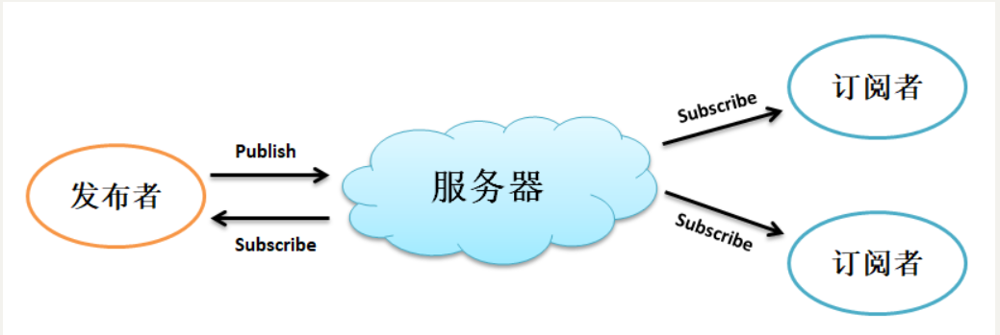
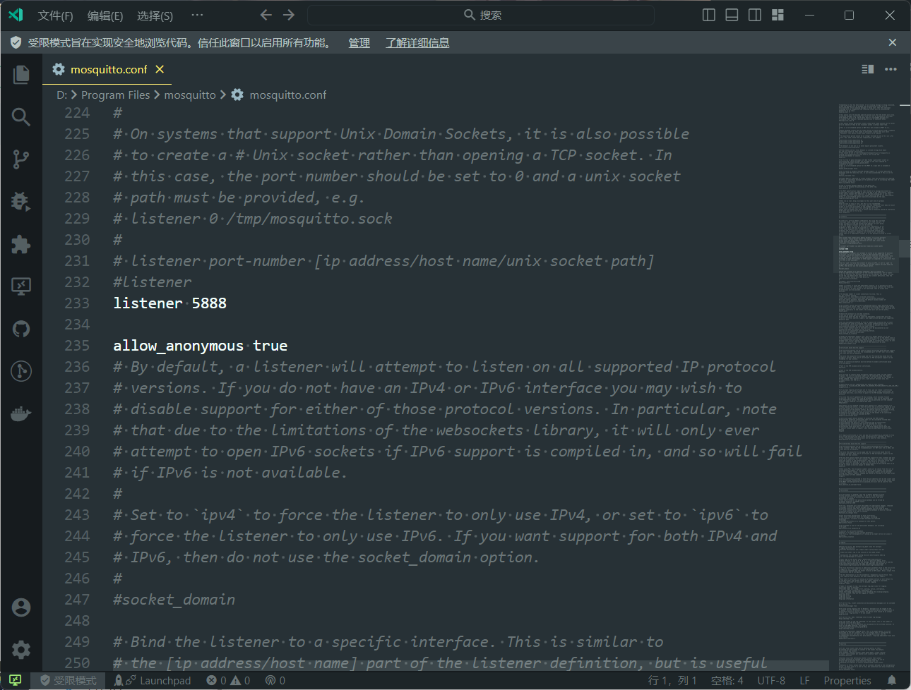
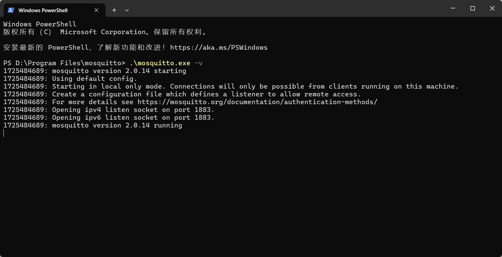
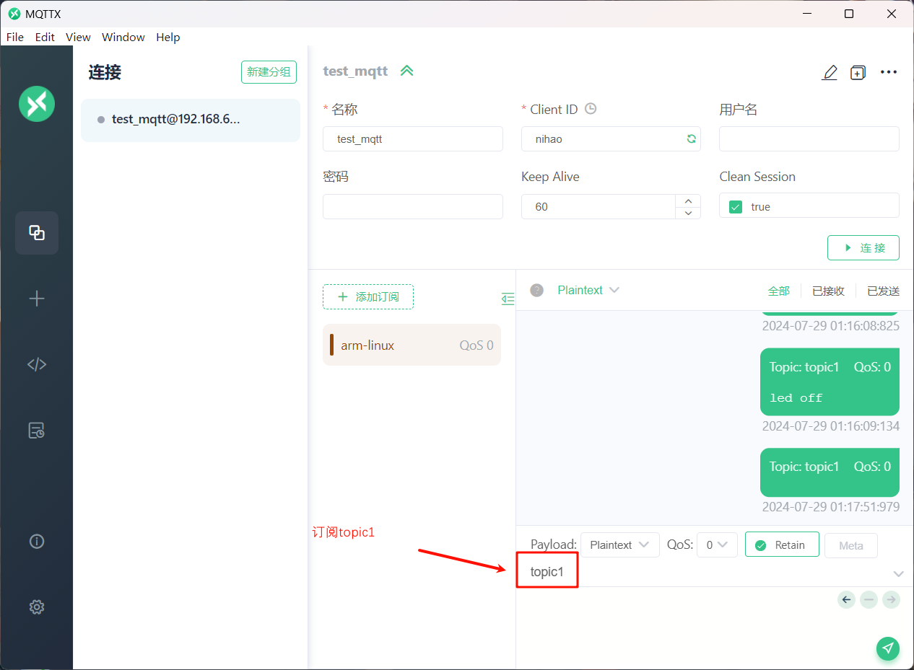
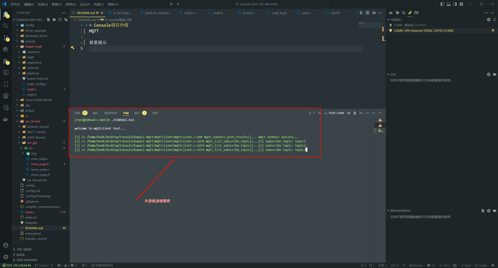
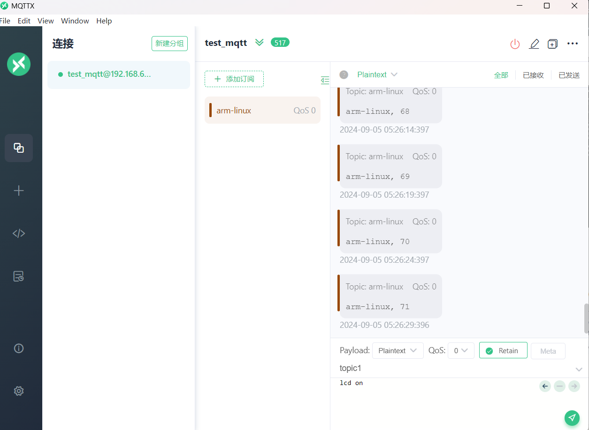
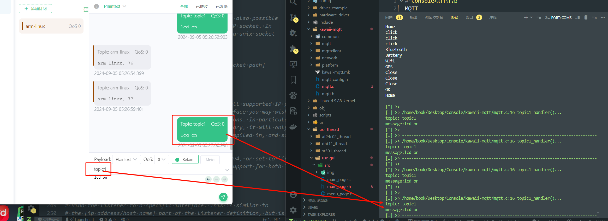

# Console项目介绍
MQTT

效果展示



* 主题(Topic)：是财经类的？还是体育类的？
* 消息(Message)或负载(Playload)：具体的新闻信息

配置监听端口号



## 启动服务器

```powershell
cd  "c:\Program Files\mosquitto"
.\mosquitto.exe -v
```




## 打开MQTT一个开源客户端



## 开发板启动程序








